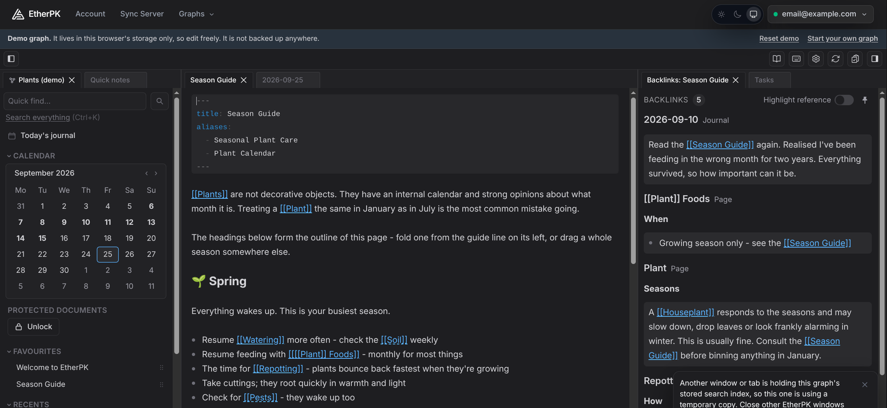

# EtherPK Client

[](https://github.com/appsoftwareltd/etherpk-client/actions/workflows/build.yaml)
[](https://github.com/appsoftwareltd/etherpk-client/actions/workflows/unit-tests.yaml)

The source of the [EtherPK](https://etherpk.com) Client and Headless Client, available under the
[Elastic License 2.0](LICENSE).



[Try the demo](https://etherpk.com) from etherpk.com. It runs in your browser, needs no account, and
keeps what you write in that browser only.

EtherPK is a personal knowledge base in plain Markdown. Journal entries hold daily thinking, pages
hold what outlives a day, and `[[wikilinks]]` tie them into a knowledge graph. The **Client** is the
editor: a SvelteKit app that opens a graph from a folder on your computer, or from a Sync Server
that stores graphs end-to-end encrypted and cannot read them. The **Headless Client** is the same
engine without an editor: an MCP server that gives an AI agent one of your graphs.

User documentation is at <https://docs.etherpk.com>.

## Licence

The Elastic License 2.0 lets you use, copy, modify and self-host this software. It does not let you
offer it to others as a hosted or managed service. It is a source-available licence, not an open
source one.

## Contents

| Path | Contents |
| --- | --- |
| `apps/client` | The Client |
| `apps/mcp` | The Headless Client, published to npm as `@appsoftwareltd/etherpk-mcp` ([README](apps/mcp/README.md)) |
| `packages/shared` | Code the Client shares with the Sync Server: the sync protocol, UI components and auth pages |
| `packages/themes` | The site themes the publisher bundles |

## Run it

### Docker image

```bash
docker run --rm -p 3000:3000 ghcr.io/appsoftwareltd/etherpk-client:latest
```

Open <http://localhost:3000>. With no settings the Client works with graph folders on your
computer and offers a **Custom server** form for connecting to a Sync Server by its address. The
settings it reads are listed, with their defaults, in
[`apps/client/.env.example`](apps/client/.env.example); pass them with `--env-file`.

### Node bundle

Each release attaches `etherpk-client-<version>.tar.gz`, which runs on Node.js 22 or later on
Windows, macOS and Linux, with nothing to install:

```bash
tar -xzf etherpk-client-<version>.tar.gz
cd etherpk-client
HOST=127.0.0.1 PORT=3000 node build
```

The full guide, including Windows commands, is
[Running EtherPK On Your Own Computer](https://docs.etherpk.com/running-etherpk-on-your-own-computer).

### Headless Client

```bash
npx @appsoftwareltd/etherpk-mcp --help
```

Setup for each kind of graph is in [`apps/mcp/README.md`](apps/mcp/README.md).

## Build from source

You need Node.js 22 or later and pnpm; `corepack enable` provides the pnpm version that
`package.json` names.

```bash
pnpm install --frozen-lockfile
pnpm dev          # the Client on http://localhost:5174
pnpm check        # type check
pnpm lint
pnpm test         # Vitest unit suites
pnpm build        # the Client and the Headless Client
docker build -f apps/client/Dockerfile -t etherpk-client .
```

Copy `apps/client/.env.example` to `apps/client/.env` to change the development settings.

## Versions and releases

- Every commit on `main` publishes images tagged `edge` and `sha-<commit>`.
- A release is a `v<version>` tag. It publishes images tagged `<version>`, `<major>.<minor>` and
  `latest`, a GitHub Release with the Node bundle attached, and `@appsoftwareltd/etherpk-mcp` at
  the same version on npm.
- The Client and the Headless Client share one version number with EtherPK's Sync Server, and
  only matching versions are tested together. A Client and a Sync Server on different sync
  protocol versions refuse to sync, and the Client says which side needs upgrading.

## How this repository is maintained

This repository is a one-way copy of App Software's private EtherPK repository, exported on every
change there. Each commit here is one export; its `GitOrigin-RevId` trailer names the private
commit it came from. Code comments cite design records (`ADR 0072`) and glossary terms
(`[[Knowledge Graph]]`) that live in the private repository and are not published here.

Issues are welcome. Pull requests are not merged here; [CONTRIBUTING.md](CONTRIBUTING.md) explains
why and what happens instead. Report security issues as [SECURITY.md](SECURITY.md) describes.
