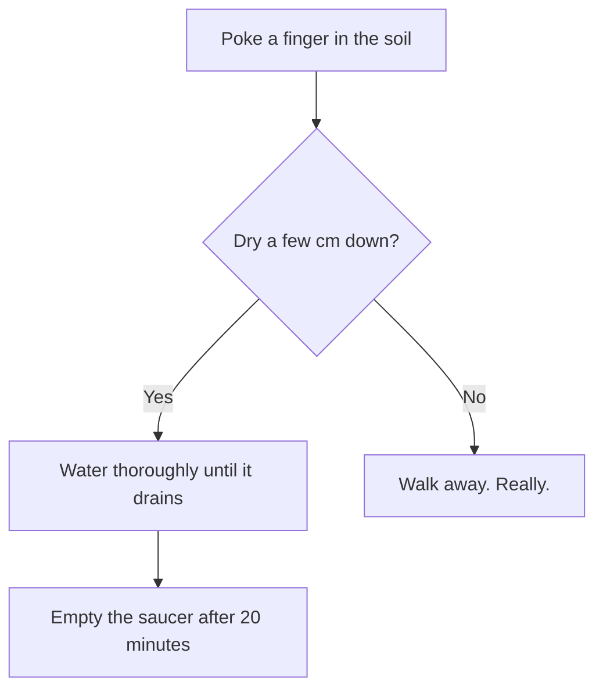

More nuanced than "pour water on it", but not much. The rule: check the [[Soil]], not the calendar.

## The decision



## A rough interval

If you must have a number, the days between waterings scale with pot volume and inversely with how warm and bright the spot is. For a pot of volume $V$ litres in a room at $T$ degrees:

```math
d \approx \frac{7\,V}{1 + 0.05\,(T - 18)}
```

Which gives about a week for a 1 litre pot at 18 °C and a bit under five days at 28 °C. It's a guess dressed up as a formula, but it's a *better* guess than "every Sunday".

## The same thing as code

```javascript
function daysUntilWatering(litres, celsius) {
    return (7 * litres) / (1 + 0.05 * (celsius - 18))
}
```

Fenced code highlights in place and stays editable - there's no widget to click out of.

## Further reading

The RHS has a sensible page on it: https://www.rhs.org.uk/plants/types/houseplants/watering

Signs you've got it wrong: [[Yellow Leaves]] (too much), crispy edges (too little), fungus gnats ([[Pests]], and too much again).
